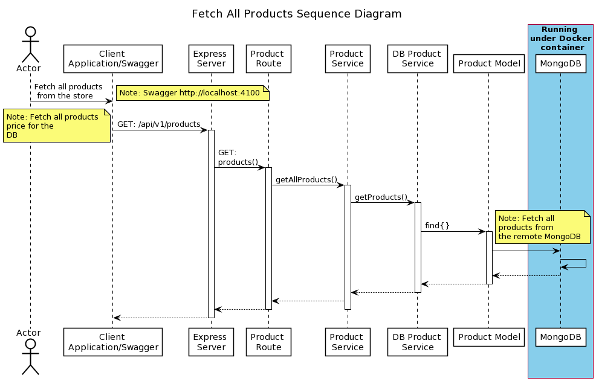
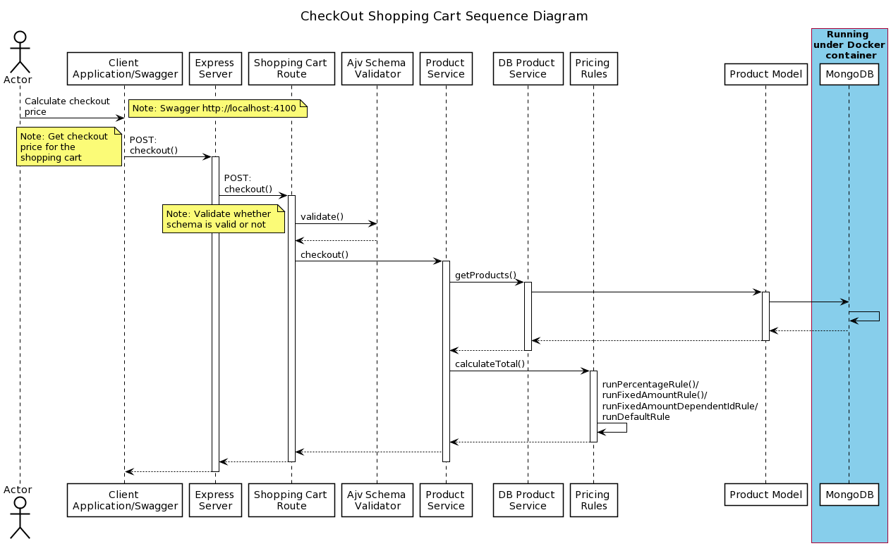

# Product Cart Application 
This is a complete client-server typescript based application comprises of node express server and react based SPA client. 

It demonstrates functionality of create, read, update and delete operations of products in the store and Also, to calculate the shopping cart total checkout price based on the configured rules setup in the rule engine on the front end i.e. productcart-client. The rules are specified in `productcart-server\src\libs\rulesdata.ts` file.

It has capability of returning the payable amount based on the selected products and taking provided promotion code from its server api `checkout`. The application is initialised with 3 products as listed below, details of which are fetched from `productcart-server\src\libs\initialData.ts` file

Here is the price list to begin with..
| PRODUCT ID | PRODUCT NAME        |    PRICE |
| ---------- | :------------------ | -------: |
| wf         | Workflow            | \$199.99 |
| mbp        | Document Generation |   \$9.99 |
| docgen     | Form                |  \$99.99 |

Some discounts are offered and these are listed below .

| PROMO CODE | DESCRIPTION                                                                       |
| ---------- | :-------------------------------------------------------------------------------- |
| RRD4D32    | 10% discount for orders above $1000 (pre-discount)                                |
| 44F4T11    | 15% discount for orders above $1500 (pre-discount)                                |
| FF9543D1   | Reduces the docgen price to $8.99 a unit when at least 10 documents are purchased |
| YYGWKJD    | Reduces the form price to $89.99 a unit when at least 1 wf is purchased           |

For simplicity sake, only one promotion code can be applied at a time.

## Example scenarios
### **Scenario 1**

**Products:**	2x wf

**Promotion:** 

**Total:**	$399.98
 	 
### **Scenario 2**
**Products:**	6x wf

**Promotion:**	RRD4D32

**Total:**	$1,079.94
 	 
### **Scenario 3**

**Products:**	1x wf, 1x form

**Promotion**:	YYGWKJD

**Total:**	$289.98

## Features
  The following sequence diagrams describe two essential operations which are available from the productcart-client.

  - **Display all the products in  `http://localhost:3001/products`**
  

  
  - **Display the price of the selected producs from the shopping cart, after applying the selected promotion code `http://localhost:3001/checkout`**
  

## Getting Started
```
- git clone https://github.com/golashr/productcart.git
- Follow steps specified in the README under `productcart-server` folder
- Follow steps specified in the README under `productcart-client` folder
```

## Prerequisite
- Docker Desktop
- In order to run product-cart server, the MongoDB and Swagger docker containers should be running as pre-requisite. The containers details are
  given in docker-compose.yml

## Not addressed
  - Mocha, Chai based Unit testing
  - Jest based Unit testing

